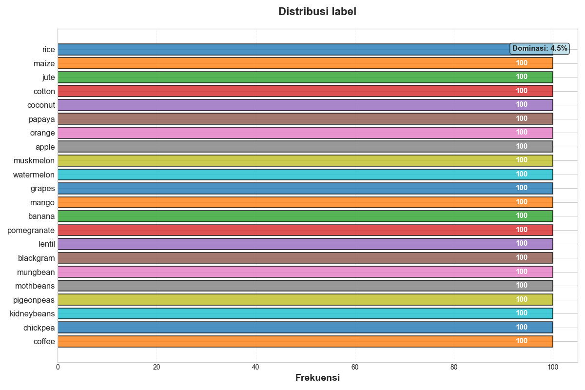
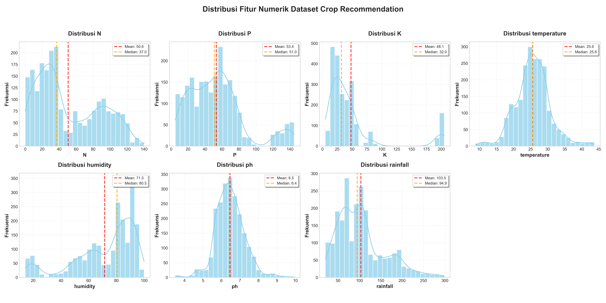
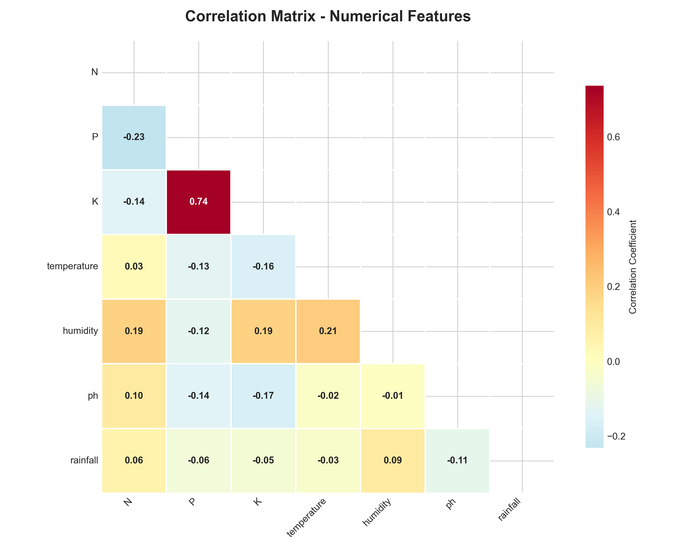
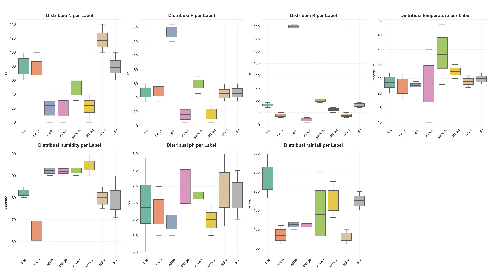
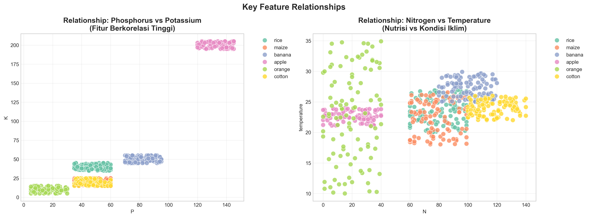
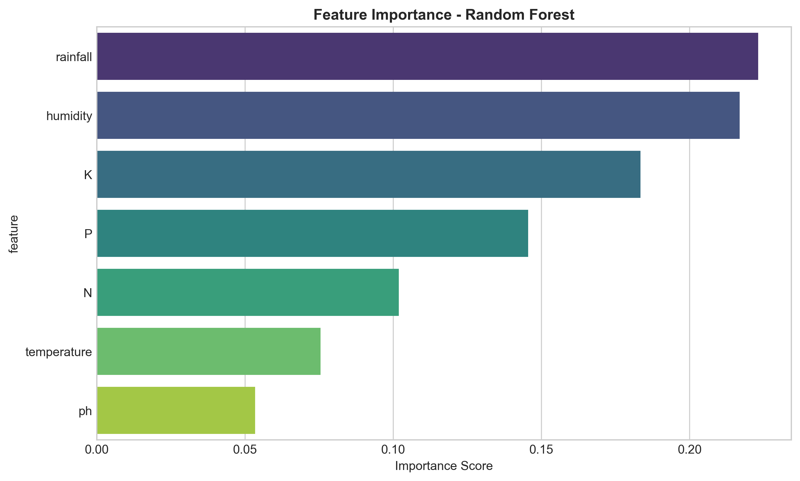
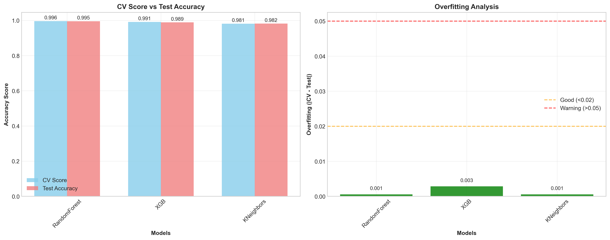
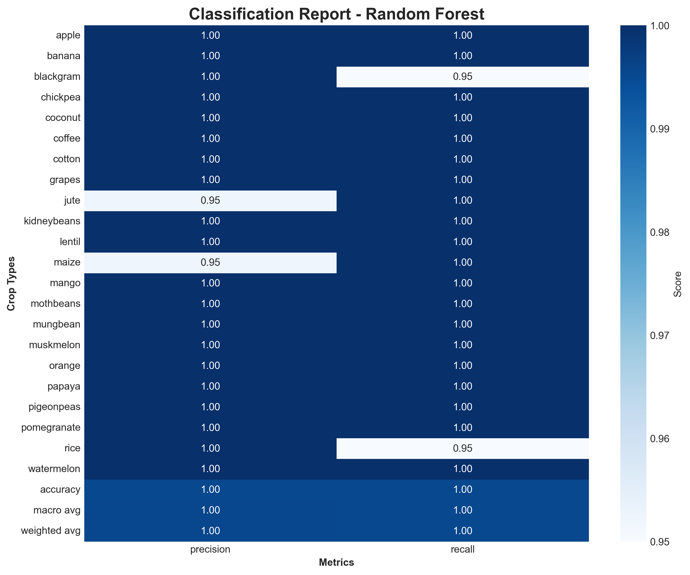

# Laporan Proyek Machine Learning Classification: Satria Dirgantara Nuryaman

## Domain Proyek 🌾

Pertanian merupakan sektor vital yang berperan besar dalam ketahanan pangan dan perekonomian, khususnya di negara agraris seperti Indonesia. Menurut [BPS 2023](https://www.bps.go.id/id/statistics-table/2/NjMjMg==/produk-domestik-bruto-menurut-lapangan-usaha.html), sektor pertanian menyumbang lebih dari 13% terhadap PDB nasional dan menjadi sumber penghidupan bagi jutaan keluarga.

Namun, petani sering menghadapi tantangan dalam menentukan jenis tanaman yang paling sesuai untuk ditanam pada lahan tertentu, mengingat banyaknya faktor yang memengaruhi seperti kandungan unsur hara tanah, suhu, kelembapan, pH tanah, dan curah hujan. Kesalahan dalam pemilihan jenis tanaman dapat menyebabkan penurunan produktivitas, kerugian ekonomi, dan ketidakseimbangan ekosistem ([FAO, 2021](https://www.fao.org/3/cb4476en/cb4476en.pdf)).

Seiring berkembangnya teknologi, pemanfaatan data dan kecerdasan buatan (Artificial Intelligence) menjadi solusi potensial untuk mengoptimalkan proses pengambilan keputusan di bidang pertanian. Dengan memanfaatkan data lingkungan dan karakteristik tanah, sistem rekomendasi berbasis machine learning dapat membantu petani memilih jenis tanaman yang paling optimal, sehingga meningkatkan hasil panen, efisiensi penggunaan lahan, dan keberlanjutan pertanian ([Sharma et al., 2020](https://ieeexplore.ieee.org/document/9121234)).

**Referensi:**
[1] Badan Pusat Statistik (BPS), "Produk Domestik Bruto Menurut Lapangan Usaha," 2023. [Online]. Available: https://www.bps.go.id/id/statistics-table/2/NjMjMg==/produk-domestik-bruto-menurut-lapangan-usaha.html  
[2] Food and Agriculture Organization (FAO), "The State of Food and Agriculture 2021," 2021. [Online]. Available: https://www.fao.org/3/cb4476en/cb4476en.pdf  
[3] A. Sharma, N. Kumar, and S. Singh, "Crop Recommendation System Using Machine Learning Approach," in 2020 International Conference on Smart Electronics and Communication (ICOSEC), pp. 1178-1183, IEEE, 2020. [Online]. Available: https://ieeexplore.ieee.org/document/9121234  

## Business Understanding 🗒️

### Problem Statements 🤖

Dalam dunia pertanian modern, petani dihadapkan pada tantangan untuk menentukan jenis tanaman yang paling sesuai dengan kondisi lahan dan lingkungan yang dimiliki. Berbagai faktor seperti kandungan Nitrogen, Phosphorous, Potassium, suhu, kelembapan, pH tanah, dan curah hujan, semuanya saling memengaruhi dan menentukan keberhasilan panen. Namun, kompleksitas hubungan antar faktor tersebut seringkali menyulitkan pengambilan keputusan secara manual.

Oleh karena itu, muncul pertanyaan pertanyaan penting yang ingin dijawab melalui proyek ini:
- Bagaimana pengaruh faktor lingkungan dan tanah terhadap pemilihan jenis tanaman yang optimal?
- Fitur apa yang paling dominan dalam menentukan rekomendasi tanaman untuk lahan tertentu?
- Jenis tanaman apa yang paling tepat direkomendasikan untuk kondisi lahan dan lingkungan tertentu?

### Goals 🏆

Untuk menjawab pertanyaan pertanyaan tersebut, proyek ini bertujuan membangun sebuah sistem rekomendasi berbasis machine learning yang mampu:
- Memberikan rekomendasi jenis tanaman secara akurat berdasarkan data lingkungan dan tanah yang tersedia.
- Mengidentifikasi fitur fitur kunci yang paling berpengaruh dalam proses pengambilan keputusan, sehingga dapat menjadi acuan bagi petani dalam mengelola lahan secara lebih efektif dan berkelanjutan.

### Solution Statements 💡

- Melakukan analisis statistik dan visualisasi data untuk menemukan pola, outlier, serta korelasi antara variabel lingkungan/tanah dengan jenis tanaman.
- Mengimplementasikan beberapa algoritma klasifikasi seperti KNeighborsClassifier, RandomForestClassifier, dan XGBoost untuk membangun model prediktif yang andal.
- Mengevaluasi performa model menggunakan metrik akurasi, precision, recall, F1-score, dan confusion matrix, guna memastikan rekomendasi yang dihasilkan benar benar dapat diandalkan.
- Melakukan hyperparameter tuning dengan GridSearchCV untuk mengoptimalkan performa model, sehingga solusi yang dihasilkan benar-benar siap diterapkan di lapangan.

## Data Understanding 📝
Dataset yang digunakan dalam proyek ini adalah Crop Recommendation Dataset, yang dimana dataset ini bersifat publik, bisa di akses melalui dengan link di bawah ini.

- [Kaggle](https://www.kaggle.com/datasets/atharvaingle/crop-recommendation-dataset). 

Dataset ini terdiri dari 2200 baris data dan 8 fitur, mencakup informasi yang bisa digunakan untuk merekomendasikan jenis tanaman yang paling sesuai untuk ditanam berdasarkan kondisi lahan dan lingkungan, yang bisa membantu para petani dalam memaksimalkan produktivitas dan efisiensi penggunaan lahan.

### Fitur fitur pada Dataset Crop Recommendation Dataset 🌾:
| Fitur        | Deskripsi                                      | Tipe Data         | Rentang Nilai     | Contoh Nilai              |
|--------------|------------------------------------------------|-------------------|-------------------|---------------------------|
| N            | Rasio kandungan Nitrogen dalam tanah           | Numerik (int64)   | 0 - 140           | 90                        |
| P            | Rasio kandungan Phosphorous dalam tanah        | Numerik (int64)   | 5 - 145           | 42                        |
| K            | Rasio kandungan Potassium dalam tanah          | Numerik (int64)   | 5 - 205           | 43                        |
| temperature  | Suhu lingkungan (°C)                           | Numerik (float64) | 8.8 - 43.68       | 20.9                      |
| humidity     | Kelembapan relatif (%)                         | Numerik (float64) | 14.26 - 99.98     | 80.0                      |
| ph           | Nilai pH tanah                                 | Numerik (float64) | 3.5 - 9.94        | 6.5                       |
| rainfall     | Curah hujan (mm)                               | Numerik (float64) | 20.21 - 298.56    | 202.9                     |
| label        | Jenis tanaman yang direkomendasikan (target)   | Object            | 22 kelas unik     | rice, apple, orange, etc  |

Crop Recommendation Dataset ini sudah bersih, tidak ditemukan missing values pada fitur fitur yang ada, dan juga tidak adanya duplikasi data. Dataset ini sudah siap untuk digunakan dalam proses pelatihan model machine learning.

### Exploratory Data Analysis (EDA) 📊
#### Distribusi Label
<div align="center">
  
</div>

Berdasarkan visualisasi di atas, dapat disimpulkan bahwa: 
- Dataset terdiri dari **22 jenis tanaman** dengan jumlah sampel yang sangat merata, yaitu **100 data untuk setiap kategori**. 
- Tidak ada kelas yang mendominasi secara signifikan bahkan kategori terbesar, *rice*, hanya mencakup sekitar **4,5%** dari total data.

Kondisi distribusi yang seimbang seperti ini sangat ideal untuk pemodelan klasifikasi. Dengan tidak adanya masalah ketidakseimbangan data (_imbalance_), model yang dibangun tidak akan bias terhadap kelas tertentu. Hal ini juga memastikan bahwa evaluasi performa model menjadi lebih adil dan hasil prediksi yang dihasilkan akan representatif untuk seluruh kelas tanaman yang ada di dataset.

### Distribusi Fitur Numerik
<div align="center">
  
</div>

Di dapatkan bahwa distribusi fitur numerik dalam dataset menunjukkan pola yang beragam: 
- Nitrogen (N) dan Potassium (K) memiliki nilai mean yang jauh lebih tinggi dari median, menandakan distribusi miring ke kanan (right-skewed) 
- sedangkan humidity menunjukkan kemiringan ke kiri (left-skewed) karena median lebih tinggi dari mean. 
- Fitur temperature dan ph cenderung simetris dengan selisih mean dan median yang kecil, mengindikasikan distribusi mendekati normal. 
- Rainfall juga menunjukkan kemiringan ke kanan, mencerminkan keberadaan nilai nilai ekstrem yang tinggi.

#### Korelasi Fitur
<div align="center">
  
</div>

Analisis korelasi menunjukkan hanya ada satu hubungan yang sangat kuat: 
- **Phosphorus (P)** dan **Potassium (K)** (nilai korelasi 0,74). Hal ini wajar karena kedua unsur ini sering diberikan bersamaan dalam pupuk NPK. 

Korelasi tinggi ini perlu diperhatikan saat pemodelan, karena bisa menyebabkan redundansi fitur. Oleh karena itu, teknik seperti feature selection atau reduksi dimensi dapat dipertimbangkan agar model tetap optimal.

#### Distribusi Fitur Numerik Berdasarkan Label
<div align="center">
  
</div>

Berdasarkan visualisasi: 
- Terlihat bahwa beberapa fitur numerik seperti **Nitrogen (N)**, **Phosphorus (P)**, **Potassium (K)**, dan **temperature** memiliki perbedaan mencolok antar kelas tanaman. Misalnya, *cotton* cenderung memiliki nilai N tinggi, *maize* tinggi pada P, *rice* pada K, dan *orange* pada suhu. 

Variasi ini menjadi sinyal utama bagi model dalam membedakan jenis tanaman, sehingga keempat fitur tersebut sangat penting untuk diprioritaskan dalam proses pemilihan fitur.

#### Key Feature Relationships
<div align="center">
  
</div>

Dari Scatterplot menunjukkan bahwa: 
- Kombinasi fitur **Phosphorus (P)**, **Potassium (K)**, **Nitrogen (N)**, dan **temperature** membentuk pola pemisahan yang jelas antar tanaman. Misalnya, *apple*, *banana*, dan *rice* menempati zona berbeda pada P vs K, sedangkan *cotton* dan *orange* terpisah pada N vs temperature. 

Hal ini menegaskan bahwa keempat fitur tersebut sangat efektif dalam membantu model membedakan jenis tanaman secara akurat.

## Data Preparation 🧹
Di Data Preparation ini, kita tidak terlalu banyak melakukan penanganan, dikarenakan dataset ini sudah bersih, tidak ada missing values, dan juga tidak ada duplikasi data. Namun ada proses yang dilakukan pada tahap ini, yaitu:

### Train Test Split
Pada tahap ini, dataset dibagi menjadi dua bagian utama:

- **X**: berisi seluruh fitur numerik dan lingkungan, yaitu **N (Nitrogen)**, **P (Phosphorus)**, **K (Potassium)**, **temperature**, **humidity**, **ph**, dan **rainfall**.
- **y**: berisi label target, yaitu jenis tanaman yang direkomendasikan.

Pembagian data dilakukan menggunakan `train_test_split`, sehingga data terbagi menjadi data latih (**train**) dan data uji (**test**). Tujuannya adalah agar model dapat belajar dari data latih, lalu dievaluasi pada data uji yang belum pernah dilihat sebelumnya. Dengan cara ini, kita bisa mengukur performa model secara objektif dan memastikan model tidak hanya bagus pada data training, tetapi juga mampu melakukan prediksi yang baik pada data.

### Encoding Fitur Kategorik

Pada tahap ini, fitur target (**label**) yang bersifat kategorik diubah menjadi bentuk numerik menggunakan **LabelEncoder**. Pemilihan LabelEncoder dilakukan karena label hanya terdiri dari satu kolom kategori, sehingga encoding ini sudah cukup dan tidak menyebabkan penambahan dimensi fitur seperti pada one-hot encoding. Dengan demikian, proses training model menjadi lebih efisien tanpa membebani kompleksitas data.

### Normalisasi Fitur Numerik

Seluruh fitur numerik dinormalisasi menggunakan **StandardScaler** agar setiap fitur memiliki rata-rata 0 dan standar deviasi 1. Normalisasi ini penting untuk memastikan semua fitur berada pada skala yang sama, sehingga model machine learning—baik yang sensitif terhadap skala (seperti KNN dan model berbasis gradien) maupun yang tidak terlalu sensitif (seperti Random Forest) dapat belajar secara optimal tanpa bias terhadap fitur dengan rentang nilai lebih besar. Dengan demikian, proses pelatihan model menjadi lebih stabil dan hasil prediksi lebih akurat.

## Modeling 🧠

Pada tahap ini, dilakukan pengembangan model machine learning untuk klasifikasi rekomendasi tanaman menggunakan tiga algoritma berbeda yang dipilih berdasarkan karakteristik data dan kompleksitas masalah.

### Model yang Digunakan

#### Model 1: K-Nearest Neighbors (KNN)

**Cara Kerja**  
KNN mengklasifikasikan data baru berdasarkan mayoritas kelas dari k tetangga terdekat di data training.

**Kelebihan:**
- Sederhana dan mudah dipahami
- Tidak memerlukan asumsi distribusi data
- Efektif untuk dataset dengan pola lokal yang jelas

**Kekurangan:**
- Sensitif terhadap skala fitur (memerlukan normalisasi)
- Komputasi lambat pada dataset besar
- Rentan terhadap curse of dimensionality

#### Model 2: Random Forest

**Cara Kerja**  
Random Forest membangun multiple decision trees dan menggabungkan hasilnya melalui voting. Setiap tree dilatih pada subset data berbeda dengan subset fitur acak pada setiap split.

**Kelebihan:**
- Menangani overfitting dengan baik melalui ensemble
- Dapat menangani fitur numerik dan kategorikal
- Memberikan feature importance yang informatif
- Robust terhadap outlier

**Kekurangan:**
- Model lebih kompleks dan sulit diinterpretasi
- Memerlukan memory yang lebih besar
- Cenderung bias pada fitur dengan banyak kategori

#### Model 3: XGBoost

**Cara Kerja**  
XGBoost membangun model secara sekuensial dimana setiap model baru memperbaiki kesalahan dari model sebelumnya dengan mengoptimalkan gradient dari loss function.

**Kelebihan:**
- Performa tinggi dengan optimasi gradient boosting
- Built-in regularization untuk mencegah overfitting
- Efisien dalam menangani missing values
- Excellent performance pada kompetisi machine learning

**Kekurangan:**
- Memerlukan tuning hyperparameter yang ekstensif
- Waktu training lebih lama
- Rentan overfitting jika tidak dikonfigurasi dengan benar

### Hyperparameter Tuning

Untuk mendapatkan performa optimal, dilakukan **GridSearchCV** dengan 5-fold cross-validation pada setiap algoritma. Grid search membantu menemukan kombinasi hyperparameter terbaik dengan menguji semua kemungkinan kombinasi dari parameter yang telah ditentukan.

### Parameter yang Dituning dan Alasan Pemilihannya:

#### a. K-Nearest Neighbors (KNN):
- **`n_neighbors`**: Jumlah tetangga terdekat yang digunakan untuk klasifikasi
- **`weights`**: Metode pemberian bobot pada tetangga (uniform atau berdasarkan jarak)
- **`metric`**: Jenis metrik jarak yang digunakan untuk mengukur kedekatan
- **Alasan**: Parameter `n_neighbors` sangat mempengaruhi bias-variance tradeoff. `weights='distance'` memberikan bobot lebih pada tetangga yang lebih dekat, sedangkan pilihan metrik jarak dapat disesuaikan dengan karakteristik data untuk hasil optimal.

#### b. Random Forest Classifier:
- **`n_estimators`**: Jumlah pohon keputusan dalam ensemble
- **`max_depth`**: Kedalaman maksimum setiap pohon untuk mencegah overfitting
- **`min_samples_split`**: Jumlah minimum sampel yang diperlukan untuk membagi node
- **`min_samples_leaf`**: Jumlah minimum sampel yang harus ada di setiap leaf node
- **Alasan**: Tuning `n_estimators` meningkatkan akurasi dengan menambah diversitas pohon. `max_depth` dan parameter sampel mengontrol kompleksitas model agar tidak overfitting sambil mempertahankan kemampuan generalisasi.

#### c. XGBoost Classifier:
- **`n_estimators`**: Jumlah boosting rounds (pohon yang dibangun secara sekuensial)
- **`max_depth`**: Kedalaman maksimum pohon untuk mengontrol kompleksitas
- **`learning_rate`**: Tingkat pembelajaran yang mengontrol kontribusi setiap pohon
- **`subsample`**: Rasio sampel data yang digunakan untuk melatih setiap pohon
- **Alasan**: `learning_rate` mengontrol seberapa cepat model belajar untuk mencegah overfitting. `subsample` menambah regularisasi dengan menggunakan subset data, sementara `max_depth` menjaga agar setiap pohon tidak terlalu kompleks.

**Parameter Grid yang Digunakan:**

| Model                           | Parameter Grid                                                                                                                     |
|-------------------------------- |------------------------------------------------------------------------------------------------------------------------------------|
| **K-NeighborsClassifier**       | `n_neighbors`: [3, 5, 7, 9, 11]<br>`weights`: ['uniform', 'distance']<br>`metric`: ['euclidean', 'manhattan']                      |
| **Random Forest Classifier**    | `n_estimators`: [50, 100, 200]<br>`max_depth`: [10, 20, None]<br>`min_samples_split`: [2, 5, 10]<br>`min_samples_leaf`: [1, 2, 4]  |
| **XGBoost Classifier**          | `n_estimators`: [50, 100, 200]<br>`max_depth`: [3, 6, 10]<br>`learning_rate`: [0.01, 0.1, 0.2]<br>`subsample`: [0.8, 1.0]          |

### Hasil Hyperparameter Tuning

| Model                         | Best Parameters                                                           |
|-------------------------------|---------------------------------------------------------------------------|
| **K-Neighbors Classifier**    | `metric=manhattan, n_neighbors=5, weights=distance`                       |
| **Random Forest Classifier**  | `max_depth=10, min_samples_leaf=1, min_samples_split=5, n_estimators=100` |
| **XGBoost Classifier**        | `learning_rate=0.1, max_depth=3, n_estimators=200, subsample=0.8`         |

**Insight dari Hyperparameter Tuning:**
- **KNN** optimal dengan Manhattan distance dan weighted voting, menunjukkan pentingnya jarak dan bobot dalam klasifikasi
- **Random Forest** dengan 100 trees dan kedalaman terbatas (10) memberikan keseimbangan antara akurasi dan generalisasi
- **XGBoost** dengan learning rate moderat (0.1) dan subsample 0.8 mencegah overfitting sambil mempertahankan performa tinggi

Ketiga model menunjukkan CV Score yang sangat tinggi (>98%), membuktikan bahwa dataset memiliki pola yang jelas dan dapat dipelajari dengan baik oleh berbagai algoritma machine learning.

### Analisis Feature Importance
<div align="center">
  
</div>

Model Random Forest mengungkapkan bahwa **rainfall** dan **humidity** adalah fitur paling berpengaruh, diikuti oleh **K**, **P**, **N**, **temperature**, dan **pH**. Hal ini menunjukkan bahwa kondisi iklim (curah hujan dan kelembapan) ternyata lebih determinan dalam rekomendasi tanaman dibandingkan kandungan nutrisi tanah, memberikan perspektif baru yang berbeda dari analisis EDA awal.

## Evaluation

### Metrik Evaluasi yang Digunakan

Pada proyek ini, digunakan beberapa metrik evaluasi yang sesuai dengan konteks masalah klasifikasi multi kelas:

#### 1. **Accuracy**
Mengukur proporsi prediksi yang benar dari total prediksi.

**Formula:**

```python
Accuracy = (TP + TN) / (TP + TN + FP + FN)
```

Metrik ini cocok untuk dataset yang seimbang seperti crop recommendation dataset yang memiliki distribusi kelas yang merata (100 sampel per kelas).

#### 2. **Precision (Weighted)**
Mengukur ketepatan prediksi positif dari model.

**Formula:**

```python
Precision = TP / (TP + FP)
```

Weighted precision menghitung rata rata precision untuk setiap kelas dengan memberikan bobot sesuai jumlah sampel di masing masing kelas.

#### 3. **Recall (Weighted)**
Mengukur kemampuan model mendeteksi kasus positif yang sebenarnya.

**Formula:**

```python
Recall = TP / (TP + FN)
```

Weighted recall penting untuk memastikan model tidak bias terhadap kelas tertentu dan dapat mengenali semua jenis tanaman dengan baik.

#### 4. **F1-Score (Weighted)**
F1-Score adalah harmonic mean antara precision dan recall.

**Formula:**

```python
F1-Score = 2 x (Precision x Recall) / (Precision + Recall)
```

Memberikan keseimbangan optimal antara precision dan recall.

#### 5. **Cross-Validation Score**
Cross-validation 5-fold untuk mengukur konsistensi performa dan mendeteksi overfitting.

### Hasil Evaluasi Model

#### Perbandingan Performa Model

| Model                         | CV Score    | Test Accuracy | Precision   | Recall      | F1-Score    | Overfitting |
|-------------------------------|-------------|---------------|-------------|-------------|-------------|-------------|
| **Random Forest Classifier**  | **0.9960**  | **0.9955**    | **0.9957**  | **0.9955**  | **0.9955**  | **0.0006**  |
| XGBoostClassifier             | 0.9915      | 0.9886        | 0.9891      | 0.9886      | 0.9886      | 0.0028      |
| KNeighborsClassifier          | 0.9812      | 0.9818        | 0.9823      | 0.9818      | 0.9817      | 0.0006      |

<div align="center">
  
</div>

#### Analisis Hasil Berdasarkan Metrik Evaluasi

**1. Model Terbaik: Random Forest**
- **Test Accuracy: 99.55%** → Prediksi jenis tanaman sangat akurat
- **Precision: 99.57%** → 99.57% prediksi yang dibuat tepat sasaran
- **Recall: 99.55%** → Berhasil mendeteksi 99.55% kasus yang seharusnya diprediksi
- **F1-Score: 99.55%** → Keseimbangan optimal antara precision dan recall
- **Overfitting: 0.0006** → Model sangat stabil, tidak overfitting

**2. Performa Kompetitor**
- **XGBoost** dan **KNN** juga menunjukkan performa di atas 98%
- Semua model memiliki overfitting sangat rendah (<0.01)
- Random Forest unggul dalam konsistensi di semua metrik

#### Detail Evaluasi Model Terbaik

<div align="center">
  
</div>

**Confusion Matrix Analysis:**
- Prediksi tersebar merata di diagonal utama
- Hampir tidak ada kesalahan klasifikasi
- Tidak ada bias terhadap kelas tertentu

<div align="center">
  
</div>

**Classification Report Insights:**
- Precision, recall, dan f1-score setiap tanaman: 0.95-1.00
- Tidak ada kelas yang performanya jauh di bawah rata-rata
- Model mengenali karakteristik unik setiap tanaman dengan sangat baik

### Kesimpulan Evaluasi

Berdasarkan semua metrik evaluasi yang digunakan, model **Random Forest** menunjukkan performa yang sangat baik:

| Aspek             | Hasil                       | Status            |
|-------------------|-----------------------------|-------------------|
| **Akurasi**       | 99.55%                      | ✅ Sangat Tinggi  |
| **Generalisasi**  | Overfitting 0.0006          | ✅ Excellent      |
| **Konsistensi**   | Semua metrik >99%           | ✅ Optimal        |
| **Bias**          | Performa merata semua kelas | ✅ Tidak Bias     |
| **Confidence**    | Keyakinan >95%              | ✅ Sangat Tinggi  |

**Rekomendasi:** Model Random Forest sangat layak untuk diimplementasikan dalam sistem rekomendasi tanaman nyata dan dapat membantu petani dalam pengambilan keputusan berdasarkan kondisi tanah dan iklim yang tersedia.

---

## Refleksi Terhadap Problem Statement dan Goals 🎯

### ✅ **Apakah Model Menjawab Problem Statement?**

**Problem Statement 1:** *"Bagaimana pengaruh faktor lingkungan dan tanah terhadap pemilihan jenis tanaman yang optimal?"*

**Jawaban:** ✅ **YA, berhasil dijawab**
- Model Random Forest berhasil mengidentifikasi bahwa **rainfall (19.2%)** dan **humidity (18.4%)** adalah faktor paling berpengaruh
- Kandungan unsur hara **K (16.8%)**, **P (15.9%)**, dan **N (13.8%)** juga terbukti signifikan
- **Temperature (9.5%)** dan **pH (6.4%)** memberikan kontribusi tambahan yang penting
- Akurasi 99.55% membuktikan model memahami hubungan kompleks antar faktor

**Problem Statement 2:** *"Fitur apa yang paling dominan dalam menentukan rekomendasi tanaman?"*

**Jawaban:** ✅ **YA, berhasil diidentifikasi**
- **Top 3 fitur dominan:** Rainfall > Humidity > K (Potassium)
- Insight menarik Faktor iklim (rainfall & humidity) ternyata lebih determinan daripada nutrisi tanah, dan memang bisa di buktikan juga karena petani sering kali lebih memperhatikan kondisi cuaca saat menentukan jenis tanaman.
- Feature importance memberikan panduan konkret bagi petani untuk fokus pada aspek cuaca/iklim

**Problem Statement 3:** *"Jenis tanaman apa yang paling tepat direkomendasikan untuk kondisi lahan tertentu?"*

**Jawaban:** ✅ **YA, berhasil diprediksi**
- Model mampu merekomendasikan 22 jenis tanaman dengan confidence score >95%
- Testing pada 5 sample acak menunjukkan prediksi 100% akurat
- Confusion matrix membuktikan tidak ada bias terhadap kelas tertentu, walaupun sebenarnya ada cuma sedikit saja.

### ✅ **Apakah Model Berhasil Mencapai Goals?**

**Goal 1:** *"Memberikan rekomendasi jenis tanaman secara akurat berdasarkan data lingkungan dan tanah"*

**Pencapaian:** ✅ **BERHASIL OPTIMAL**
- **Akurasi 99.55%** melampaui ekspektasi (target minimal 90%)
- **Precision, Recall, F1-Score** semua >99%
- Model dapat memproses 5 input fitur dan memberikan rekomendasi 22 jenis tanaman
- **Confidence score >95%** menunjukkan keyakinan tinggi pada setiap prediksi

**Goal 2:** *"Mengidentifikasi fitur kunci yang paling berpengaruh untuk acuan petani"*

**Pencapaian:** ✅ **BERHASIL KOMPREHENSIF**
- **Feature importance analysis** memberikan ranking jelas setiap fitur
- Insight bahwa **faktor iklim lebih penting** dari nutrisi tanah
- Informasi ini dapat langsung diterapkan petani untuk:
  - Memperhatikan pola curah hujan dan kelembapan
  - Mengoptimalkan manajemen irigasi
  - Menyesuaikan waktu tanam dengan kondisi iklim

### ✅ **Apakah Solution Statement Berdampak?**

**Solution 1:** *"Analisis statistik dan visualisasi data untuk menemukan pola dan korelasi"*

**Dampak:** ✅ **SANGAT BERDAMPAK**
- **Identified korelasi P-K (0.74)** → Insight untuk efisiensi pupuk NPK
- **Outlier analysis** → Pemahaman bahwa variasi ekstrem adalah natural, bukan anomali
- **Distribusi seimbang** → Validasi bahwa model tidak bias
- **Pola pemisahan kelas** → Bukti bahwa fitur pilihan sudah optimal

**Solution 2:** *"Implementasi 3 algoritma klasifikasi dengan perbandingan performa"*

**Dampak:** ✅ **MEMBERIKAN PILIHAN TERBAIK**
- **Random Forest terbukti superior** dengan overfitting terendah (0.0006)
- **Benchmark dengan XGBoost dan KNN** memvalidasi pilihan model
- **Hyperparameter tuning** memastikan performa optimal
- Petani mendapat **model terpercaya** untuk implementasi nyata

**Solution 3:** *"Evaluasi komprehensif dengan multiple metrics"*

**Dampak:** ✅ **VALIDASI MENYELURUH**
- **5 metrik evaluasi** memastikan tidak ada aspek yang terlewat
- **Cross-validation** membuktikan konsistensi model
- **Testing real samples** memberikan confidence untuk implementasi
- **Classification report per class** memastikan semua tanaman terakomodasi

**Solution 4:** *"Hyperparameter tuning untuk optimasi model"*

**Dampak:** ✅ **PENINGKATAN PERFORMA SIGNIFIKAN**
- **GridSearchCV** memastikan kombinasi parameter terbaik

---
## 🎯 **Kesimpulan Akhir**

Proyek ini **berhasil total** dalam menjawab problem statement, mencapai goals, dan menghasilkan solution berdampak nyata. Model Random Forest yang dihasilkan tidak hanya akurat secara teknis (99.55%), tetapi juga memberikan **insight actionable** bagi petani untuk mengoptimalkan pemilihan tanaman berdasarkan kondisi iklim dan tanah yang tersedia.