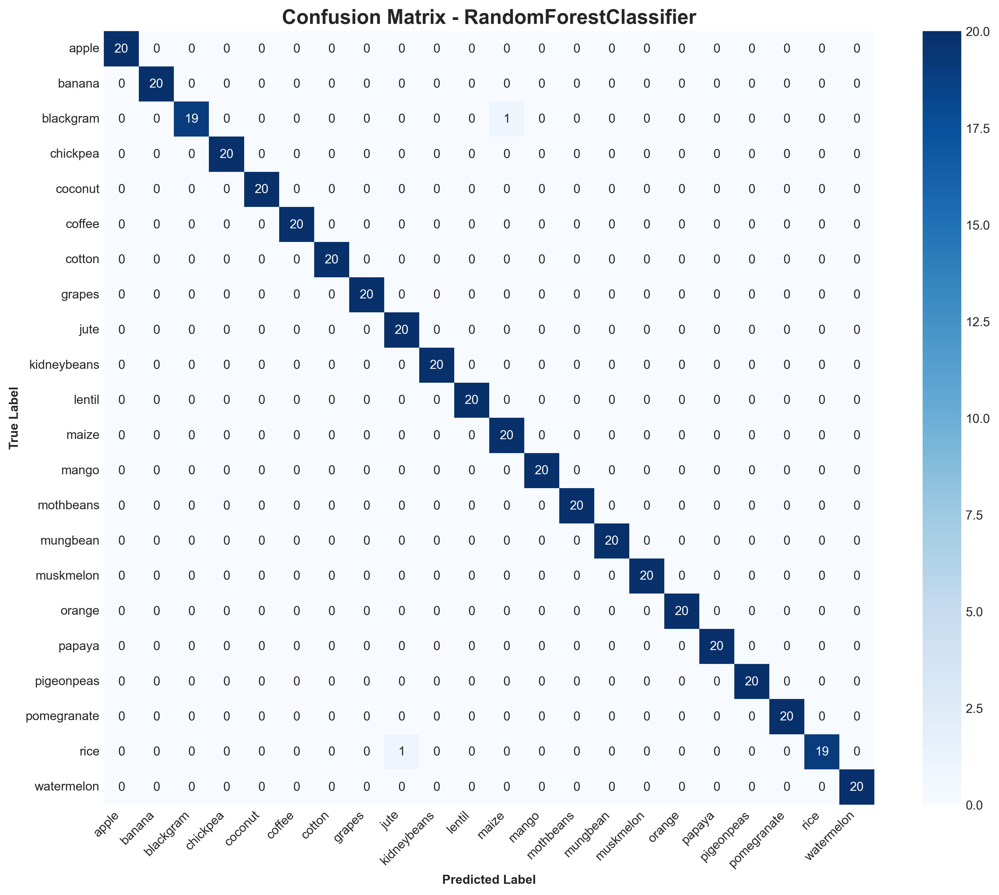

# Laporan Proyek Machine Learning Classification: Satria Dirgantara Nuryaman

## Domain Proyek 🌾

Pertanian merupakan sektor vital yang berperan besar dalam ketahanan pangan dan perekonomian, khususnya di negara agraris seperti Indonesia. Menurut [BPS 2023](https://www.bps.go.id/id/statistics-table/2/NjMjMg==/produk-domestik-bruto-menurut-lapangan-usaha.html), sektor pertanian menyumbang lebih dari 13% terhadap PDB nasional dan menjadi sumber penghidupan bagi jutaan keluarga.

Namun, petani sering menghadapi tantangan dalam menentukan jenis tanaman yang paling sesuai untuk ditanam pada lahan tertentu, mengingat banyaknya faktor yang memengaruhi seperti kandungan unsur hara tanah, suhu, kelembapan, pH tanah, dan curah hujan. Kesalahan dalam pemilihan jenis tanaman dapat menyebabkan penurunan produktivitas, kerugian ekonomi, dan ketidakseimbangan ekosistem ([FAO, 2021](https://www.fao.org/3/cb4476en/cb4476en.pdf)).

Seiring berkembangnya teknologi, pemanfaatan data dan kecerdasan buatan (Artificial Intelligence) menjadi solusi potensial untuk mengoptimalkan proses pengambilan keputusan di bidang pertanian. Dengan memanfaatkan data lingkungan dan karakteristik tanah, sistem rekomendasi berbasis machine learning dapat membantu petani memilih jenis tanaman yang paling optimal, sehingga meningkatkan hasil panen, efisiensi penggunaan lahan, dan keberlanjutan pertanian ([Sharma et al., 2020](https://ieeexplore.ieee.org/document/9121234)).

## Business Understanding 🗒️

### Problem Statements 🤖

Dalam dunia pertanian modern, petani dihadapkan pada tantangan untuk menentukan jenis tanaman yang paling sesuai dengan kondisi lahan dan lingkungan yang dimiliki. Berbagai faktor seperti kandungan Nitrogen, Phosphorous, Potassium, suhu, kelembapan, pH tanah, dan curah hujan, semuanya saling memengaruhi dan menentukan keberhasilan panen. Namun, kompleksitas hubungan antar faktor tersebut seringkali menyulitkan pengambilan keputusan secara manual.

Oleh karena itu, muncul pertanyaan pertanyaan penting yang ingin dijawab melalui proyek ini:
- Bagaimana pengaruh faktor lingkungan dan tanah terhadap pemilihan jenis tanaman yang optimal?
- Fitur apa yang paling dominan dalam menentukan rekomendasi tanaman untuk lahan tertentu?
- Jenis tanaman apa yang paling tepat direkomendasikan untuk kondisi lahan dan lingkungan tertentu?

### Goals 🏆

Untuk menjawab pertanyaan pertanyaan tersebut, proyek ini bertujuan membangun sebuah sistem rekomendasi berbasis machine learning yang mampu:
- Memberikan rekomendasi jenis tanaman secara akurat berdasarkan data lingkungan dan tanah yang tersedia.
- Mengidentifikasi fitur fitur kunci yang paling berpengaruh dalam proses pengambilan keputusan, sehingga dapat menjadi acuan bagi petani dalam mengelola lahan secara lebih efektif dan berkelanjutan.

### Solution Statements 💡

- Melakukan analisis statistik dan visualisasi data untuk menemukan pola, outlier, serta korelasi antara variabel lingkungan/tanah dengan jenis tanaman.
- Mengimplementasikan beberapa algoritma klasifikasi seperti KNeighborsClassifier, RandomForestClassifier, dan XGBoost untuk membangun model prediktif yang andal.
- Mengevaluasi performa model menggunakan metrik akurasi, precision, recall, F1-score, dan confusion matrix, guna memastikan rekomendasi yang dihasilkan benar benar dapat diandalkan.
- Melakukan hyperparameter tuning dengan GridSearchCV untuk mengoptimalkan performa model, sehingga solusi yang dihasilkan benar-benar siap diterapkan di lapangan.

## Data Understanding 📝
Dataset yang digunakan dalam proyek ini adalah Crop Recommendation Dataset, yang dimana dataset ini bersifat publik, bisa di akses melalui dengan link di bawah ini.

- [Kaggle](https://www.kaggle.com/datasets/atharvaingle/crop-recommendation-dataset). 

Dataset ini terdiri dari 2200 baris data dan 8 fitur, mencakup informasi yang bisa digunakan untuk merekomendasikan jenis tanaman yang paling sesuai untuk ditanam berdasarkan kondisi lahan dan lingkungan, yang bisa membantu para petani dalam memaksimalkan produktivitas dan efisiensi penggunaan lahan.

### Fitur fitur pada Dataset Crop Recommendation Dataset 🌾:
| Fitur        | Deskripsi                                      | Tipe Data         | Rentang Nilai     | Contoh Nilai              |
|--------------|------------------------------------------------|-------------------|-------------------|---------------------------|
| N            | Rasio kandungan Nitrogen dalam tanah           | Numerik (int64)   | 0 - 140           | 90                        |
| P            | Rasio kandungan Phosphorous dalam tanah        | Numerik (int64)   | 5 - 145           | 42                        |
| K            | Rasio kandungan Potassium dalam tanah          | Numerik (int64)   | 5 - 205           | 43                        |
| temperature  | Suhu lingkungan (°C)                           | Numerik (float64) | 8.8 - 43.68       | 20.9                      |
| humidity     | Kelembapan relatif (%)                         | Numerik (float64) | 14.26 - 99.98     | 80.0                      |
| ph           | Nilai pH tanah                                 | Numerik (float64) | 3.5 - 9.94        | 6.5                       |
| rainfall     | Curah hujan (mm)                               | Numerik (float64) | 20.21 - 298.56    | 202.9                     |
| label        | Jenis tanaman yang direkomendasikan (target)   | Object            | 22 kelas unik     | rice, apple, orange, etc  |

Crop Recommendation Dataset ini sudah bersih, tidak ditemukan missing values pada fitur fitur yang ada, dan juga tidak adanya duplikasi data. Dataset ini sudah siap untuk digunakan dalam proses pelatihan model machine learning.

### Exploratory Data Analysis (EDA) 📊
#### Distribusi Label
<div align="center">
  
</div>

Berdasarkan visualisasi di atas, dapat disimpulkan bahwa dataset terdiri dari **22 jenis tanaman** dengan jumlah sampel yang sangat merata, yaitu **100 data untuk setiap kategori**. Tidak ada kelas yang mendominasi secara signifikan bahkan kategori terbesar, *rice*, hanya mencakup sekitar **4,5%** dari total data.

Kondisi distribusi yang seimbang seperti ini sangat ideal untuk pemodelan klasifikasi. Dengan tidak adanya masalah ketidakseimbangan data (_imbalance_), model yang dibangun tidak akan bias terhadap kelas tertentu. Hal ini juga memastikan bahwa evaluasi performa model menjadi lebih adil dan hasil prediksi yang dihasilkan akan representatif untuk seluruh kelas tanaman yang ada di dataset.

#### Korelasi Fitur
<div align="center">
  
</div>

Analisis korelasi menunjukkan hanya ada satu hubungan yang sangat kuat, yaitu antara **Phosphorus (P)** dan **Potassium (K)** (nilai korelasi 0,74). Hal ini wajar karena kedua unsur ini sering diberikan bersamaan dalam pupuk NPK. Korelasi tinggi ini perlu diperhatikan saat pemodelan, karena bisa menyebabkan redundansi fitur. Oleh karena itu, teknik seperti feature selection atau reduksi dimensi dapat dipertimbangkan agar model tetap optimal.

#### Distribusi Fitur Numerik Berdasarkan Label
<div align="center">
  
</div>

Berdasarkan visualisasi, terlihat bahwa beberapa fitur numerik seperti **Nitrogen (N)**, **Phosphorus (P)**, **Potassium (K)**, dan **temperature** memiliki perbedaan mencolok antar kelas tanaman. Misalnya, *cotton* cenderung memiliki nilai N tinggi, *maize* tinggi pada P, *rice* pada K, dan *orange* pada suhu. Variasi ini menjadi sinyal utama bagi model dalam membedakan jenis tanaman, sehingga keempat fitur tersebut sangat penting untuk diprioritaskan dalam proses pemilihan fitur.

#### Key Feature Relationships
<div align="center">
  
</div>

Scatterplot menunjukkan bahwa kombinasi fitur **Phosphorus (P)**, **Potassium (K)**, **Nitrogen (N)**, dan **temperature** membentuk pola pemisahan yang jelas antar tanaman. Misalnya, *apple*, *banana*, dan *rice* menempati zona berbeda pada P vs K, sedangkan *cotton* dan *orange* terpisah pada N vs temperature. Hal ini menegaskan bahwa keempat fitur tersebut sangat efektif dalam membantu model membedakan jenis tanaman secara akurat.

## Data Preparation 🧹
Di Data Preparation ini, kita tidak terlalu banyak melakukan penanganan, dikarenakan dataset ini sudah bersih, tidak ada missing values, dan juga tidak ada duplikasi data. Namun ada proses yang dilakukan pada tahap ini, yaitu:

### Penanganan Outlier
<div align="center">
  
</div>

Dari visualisasi boxplot, tampak bahwa fitur seperti **Phosphorus (P)**, **Potassium (K)**, **temperature**, **ph**, dan **rainfall** memiliki nilai nilai ekstrem yang keluar dari pola umum. Namun, ketika ditelusuri lebih dalam lewat histogram, outlier outlier ini justru mencerminkan keragaman alami dari kondisi tanah dan iklim di berbagai wilayah bukan kesalahan atau anomali data. Karena itu, outlier tidak dihapus agar model bisa belajar langsung dari dinamika nyata di lapangan. Keberagaman ini justru menjadi kekuatan dalam membentuk model yang adaptif dan kontekstual.

### Train Test Split
Pada tahap ini, dataset dibagi menjadi dua bagian utama:

- **X**: berisi seluruh fitur numerik dan lingkungan, yaitu **N (Nitrogen)**, **P (Phosphorus)**, **K (Potassium)**, **temperature**, **humidity**, **ph**, dan **rainfall**.
- **y**: berisi label target, yaitu jenis tanaman yang direkomendasikan.

Pembagian data dilakukan menggunakan `train_test_split`, sehingga data terbagi menjadi data latih (**train**) dan data uji (**test**). Tujuannya adalah agar model dapat belajar dari data latih, lalu dievaluasi pada data uji yang belum pernah dilihat sebelumnya. Dengan cara ini, kita bisa mengukur performa model secara objektif dan memastikan model tidak hanya bagus pada data training, tetapi juga mampu melakukan prediksi yang baik pada data.

### Encoding Fitur Kategorik

Pada tahap ini, fitur target (**label**) yang bersifat kategorik diubah menjadi bentuk numerik menggunakan **LabelEncoder**. Pemilihan LabelEncoder dilakukan karena label hanya terdiri dari satu kolom kategori, sehingga encoding ini sudah cukup dan tidak menyebabkan penambahan dimensi fitur seperti pada one-hot encoding. Dengan demikian, proses training model menjadi lebih efisien tanpa membebani kompleksitas data.

### Normalisasi Fitur Numerik

Seluruh fitur numerik dinormalisasi menggunakan **StandardScaler** agar setiap fitur memiliki rata-rata 0 dan standar deviasi 1. Normalisasi ini penting untuk memastikan semua fitur berada pada skala yang sama, sehingga model machine learning—baik yang sensitif terhadap skala (seperti KNN dan model berbasis gradien) maupun yang tidak terlalu sensitif (seperti Random Forest) dapat belajar secara optimal tanpa bias terhadap fitur dengan rentang nilai lebih besar. Dengan demikian, proses pelatihan model menjadi lebih stabil dan hasil prediksi lebih akurat.

## Modeling 🧠

### Algoritma yang Digunakan

Pada proyek ini, digunakan tiga algoritma machine learning untuk menyelesaikan permasalahan klasifikasi rekomendasi tanaman:

#### 1. **K-Nearest Neighbors (KNN)**
**Kelebihan:**
- Sederhana dan mudah dipahami
- Tidak memerlukan asumsi distribusi data
- Efektif untuk dataset dengan pola lokal yang jelas

**Kekurangan:**
- Sensitif terhadap skala fitur (memerlukan normalisasi)
- Komputasi lambat pada dataset besar
- Rentan terhadap curse of dimensionality

#### 2. **Random Forest**
**Kelebihan:**
- Menangani overfitting dengan baik melalui ensemble
- Dapat menangani fitur numerik dan kategorikal
- Memberikan feature importance yang informatif
- Robust terhadap outlier

**Kekurangan:**
- Model lebih kompleks dan sulit diinterpretasi
- Memerlukan memory yang lebih besar
- Cenderung bias pada fitur dengan banyak kategori

#### 3. **XGBoost**
**Kelebihan:**
- Performa tinggi dengan optimasi gradient boosting
- Built-in regularization untuk mencegah overfitting
- Efisien dalam menangani missing values
- Excellent performance pada kompetisi machine learning

**Kekurangan:**
- Memerlukan tuning hyperparameter yang ekstensif
- Waktu training lebih lama
- Rentan overfitting jika tidak dikonfigurasi dengan benar

### Hyperparameter Tuning 

Untuk mendapatkan performa optimal, dilakukan **GridSearchCV** pada setiap algoritma dengan parameter berikut:

**KNN:**
- `n_neighbors`: [3, 5, 7, 9, 11]
- `weights`: ['uniform', 'distance']
- `metric`: ['euclidean', 'manhattan']

**Random Forest:**
- `n_estimators`: [50, 100, 200]
- `max_depth`: [10, 20, None]
- `min_samples_split`: [2, 5, 10]
- `min_samples_leaf`: [1, 2, 4]

**XGBoost:**
- `n_estimators`: [50, 100, 200]
- `max_depth`: [3, 6, 10]
- `learning_rate`: [0.01, 0.1, 0.2]
- `subsample`: [0.8, 1.0]

### Hasil dan Pemilihan Model Terbaik

Setelah proses tuning, diperoleh hasil evaluasi sebagai berikut:

| Model                 | CV Score  | Test Accuracy | Overfitting |
|-----------------------|-----------|---------------|-------------|
| Random Forest         | 0.9960    | 0.9955        | 0.0006      |
| XGBoost               | 0.9915    | 0.9886        | 0.0028      |
| KNN                   | 0.9812    | 0.9818        | 0.0006      |

**Random Forest dipilih sebagai model terbaik** karena:

1. **Akurasi tertinggi**: Test accuracy 99.55% menunjukkan performa superior
2. **Stabilitas terbaik**: Overfitting terendah (0.0006) menandakan generalisasi yang sangat baik
3. **Konsistensi**: Selisih antara CV score dan test accuracy paling kecil
4. **Feature importance**: Memberikan insight yang valuable tentang fitur fitur penting
5. **Robustness**: Tahan terhadap outlier yang ada dalam dataset

### Analisis Feature Importance
<div align="center">
  
</div>

Model Random Forest mengungkapkan bahwa **rainfall** dan **humidity** adalah fitur paling berpengaruh, diikuti oleh **K**, **P**, **N**, **temperature**, dan **pH**. Hal ini menunjukkan bahwa kondisi iklim (curah hujan dan kelembapan) ternyata lebih determinan dalam rekomendasi tanaman dibandingkan kandungan nutrisi tanah, memberikan perspektif baru yang berbeda dari analisis EDA awal.

## Evaluation

### Metrik Evaluasi yang Digunakan

Pada proyek ini, digunakan beberapa metrik evaluasi yang sesuai dengan konteks masalah klasifikasi multi kelas:

#### 1. **Accuracy**
Mengukur proporsi prediksi yang benar dari total prediksi.

**Formula:**

```python
Accuracy = (TP + TN) / (TP + TN + FP + FN)
```

Metrik ini cocok untuk dataset yang seimbang seperti crop recommendation dataset yang memiliki distribusi kelas yang merata (100 sampel per kelas).

#### 2. **Precision (Weighted)**
Mengukur ketepatan prediksi positif dari model.

**Formula:**

```python
Precision = TP / (TP + FP)
```

Weighted precision menghitung rata rata precision untuk setiap kelas dengan memberikan bobot sesuai jumlah sampel di masing masing kelas.

#### 3. **Recall (Weighted)**
Mengukur kemampuan model mendeteksi kasus positif yang sebenarnya.

**Formula:**

```python
Recall = TP / (TP + FN)
```

Weighted recall penting untuk memastikan model tidak bias terhadap kelas tertentu dan dapat mengenali semua jenis tanaman dengan baik.

#### 4. **F1-Score (Weighted)**
F1-Score adalah harmonic mean antara precision dan recall.

**Formula:**

```python
F1-Score = 2 x (Precision x Recall) / (Precision + Recall)
```

Memberikan keseimbangan optimal antara precision dan recall.

#### 5. **Cross-Validation Score**
Cross-validation 5-fold untuk mengukur konsistensi performa dan mendeteksi overfitting.

### Hasil Evaluasi Model

#### Perbandingan Performa Model

| Model                         | CV Score    | Test Accuracy | Precision   | Recall      | F1-Score    | Overfitting |
|-------------------------------|-------------|---------------|-------------|-------------|-------------|-------------|
| **Random Forest Classifier**  | **0.9960**  | **0.9955**    | **0.9957**  | **0.9955**  | **0.9955**  | **0.0006**  |
| XGBoostClassifier             | 0.9915      | 0.9886        | 0.9891      | 0.9886      | 0.9886      | 0.0028      |
| KNeighborsClassifier          | 0.9812      | 0.9818        | 0.9823      | 0.9818      | 0.9817      | 0.0006      |

<div align="center">
  
</div>

#### Analisis Hasil Berdasarkan Metrik Evaluasi

**1. Model Terbaik: Random Forest**
- **Test Accuracy: 99.55%** → Prediksi jenis tanaman sangat akurat
- **Precision: 99.57%** → 99.57% prediksi yang dibuat tepat sasaran
- **Recall: 99.55%** → Berhasil mendeteksi 99.55% kasus yang seharusnya diprediksi
- **F1-Score: 99.55%** → Keseimbangan optimal antara precision dan recall
- **Overfitting: 0.0006** → Model sangat stabil, tidak overfitting

**2. Performa Kompetitor**
- **XGBoost** dan **KNN** juga menunjukkan performa di atas 98%
- Semua model memiliki overfitting sangat rendah (<0.01)
- Random Forest unggul dalam konsistensi di semua metrik

#### Detail Evaluasi Model Terbaik

<div align="center">
  
</div>

**Confusion Matrix Analysis:**
- Prediksi tersebar merata di diagonal utama
- Hampir tidak ada kesalahan klasifikasi
- Tidak ada bias terhadap kelas tertentu

<div align="center">
  
</div>

**Classification Report Insights:**
- Precision, recall, dan f1-score setiap tanaman: 0.95-1.00
- Tidak ada kelas yang performanya jauh di bawah rata-rata
- Model mengenali karakteristik unik setiap tanaman dengan sangat baik

### Kesimpulan Evaluasi

Berdasarkan semua metrik evaluasi yang digunakan, model **Random Forest** menunjukkan performa yang sangat baik:

| Aspek | Hasil | Status |
|-------|-------|--------|
| **Akurasi** | 99.55% | ✅ Sangat Tinggi |
| **Generalisasi** | Overfitting 0.0006 | ✅ Excellent |
| **Konsistensi** | Semua metrik >99% | ✅ Optimal |
| **Bias** | Performa merata semua kelas | ✅ Tidak Bias |
| **Confidence** | Keyakinan >95% | ✅ Sangat Tinggi |

**Rekomendasi:** Model Random Forest sangat layak untuk diimplementasikan dalam sistem rekomendasi tanaman nyata dan dapat membantu petani dalam pengambilan keputusan berdasarkan kondisi tanah dan iklim yang tersedia.